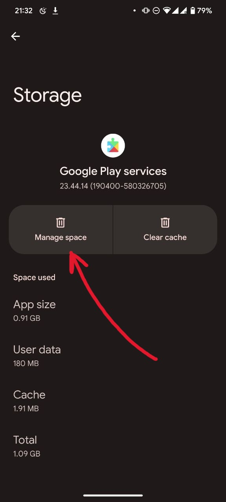
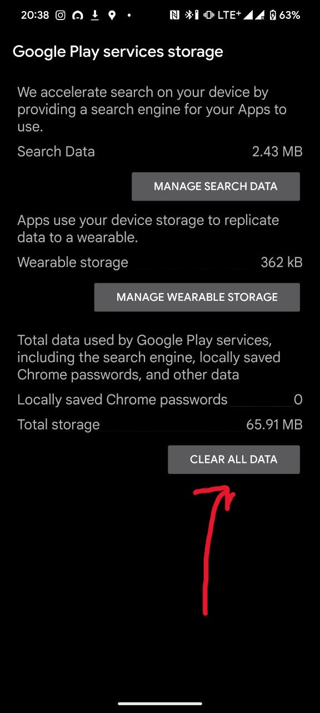

# Play Integrity Fix

A Zygisk module which fix "ctsProfileMatch" (SafetyNet) and "MEETS_DEVICE_INTEGRITY" (Play
Integrity).

To use this module you must have one of this:

- Magisk with Zygisk enabled.
- KernelSU with [ZygiskNext](https://github.com/Dr-TSNG/ZygiskNext) module installed.

[**Download the latest here**](https://github.com/chiteroman/PlayIntegrityFix/releases/latest).

## Telegram group

https://t.me/playintegrityfix

## Donations

- [PayPal](https://paypal.me/chiteroman)

## Official posts

- [XDA](https://xdaforums.com/t/module-play-integrity-fix-safetynet-fix.4607985/)

## About module

It injects a classes.dex file to modify few fields in android.os.Build class. Also, in native code
it creates a hook to modify system properties.
The purpose of the module is to avoid a hardware attestation.

## About 'pif.json' file

You can modify this file to spoof android.os.Build fields in GMS unstable process and try to pass Device verdict.
You can't use values from recent devices due this devices must use a hardware attestation.

## Failing BASIC verdict

If you are failing basicIntegrity (SafetyNet) or MEETS_BASIC_INTEGRITY (Play Integrity) something is
wrong in your setup. My recommended steps in order to find the problem:

- Disable all modules except mine.
- Check your SELinux (must be enforced).

Some modules which modify system can trigger DroidGuard detection, never hook GMS processes.

## Certify Play Store and fix Google Wallet

Follow this steps:

- Flash my module in Magisk/KernelSU (if you already have my module, just ignore this step).
- Clear Google Wallet cache (if you have it).
- Clear Google Play Store cache and data.
- Clear GMS (com.google.android.gms) cache and data (or just reboot without clear and waiting some time).

Reboot and done!

## Troubleshooting

### Fails to meet device integrity (KernelSU)

- Disable ZygiskNext
- Reboot
- Enable ZygiskNext

### Passes device integrity, but fails in Wallet (even after clearing cache)

- Remove all data from Google Play Services

<details>
<summary>Guide</summary>




</details>

## Read module logs

You can read module logs using this command:

```
adb shell "logcat | grep 'PIF'"
```

## Can this module pass MEETS_STRONG_INTEGRITY?

No.

## About Play Integrity, SafetyNet is deprecated

You can read more info
here: [click me](https://xdaforums.com/t/info-play-integrity-api-replacement-for-safetynet.4479337/)
